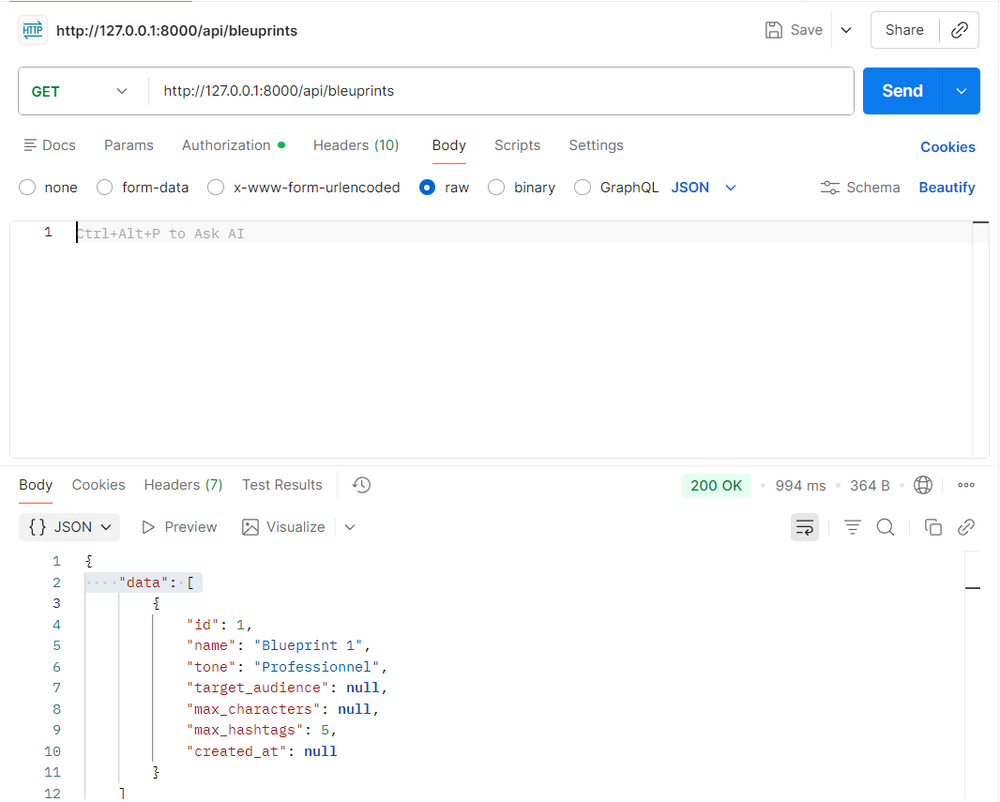

# ThreadForge API

<p align="center">
  
</p>

<p align="center">
    
    
    
    
    
</p>

---

# About the Project

**ThreadForge API** is a RESTful API built with **Laravel 12** that allows authenticated users to manage their own **Blueprints**.

Each blueprint contains customizable parameters used to generate social media content.

---

# Features

* User Registration
* User Login & Logout
* Laravel Sanctum Authentication
* CRUD Operations for Blueprints
* API Resources
* Form Request Validation
* Protected Routes

---

# Tech Stack

* Laravel 12
* PHP 8.2
* MySQL
* Laravel Sanctum
* Postman

---

# Installation

Clone the repository

```bash
git clone https://github.com/your-username/threadforge-api.git
```

Install dependencies

```bash
composer install
```

Copy environment file

```bash
cp .env.example .env
```

Generate application key

```bash
php artisan key:generate
```

Configure your database inside `.env`

Run migrations

```bash
php artisan migrate
```

Start the server

```bash
php artisan serve
```

---

# Authentication

The API uses **Laravel Sanctum**.

After login, copy the generated token and use it in Postman.

Authorization

```
Bearer YOUR_TOKEN
```

---

# API Endpoints

## Authentication

| Method | Endpoint      | Description         |
| ------ | ------------- | ------------------- |
| POST   | /api/register | Register a new user |
| POST   | /api/login    | Login               |
| POST   | /api/logout   | Logout              |

---

## Blueprints

| Method | Endpoint             |
| ------ | -------------------- |
| GET    | /api/blueprints      |
| GET    | /api/blueprints/{id} |
| POST   | /api/blueprints      |
| PUT    | /api/blueprints/{id} |
| DELETE | /api/blueprints/{id} |

---

# Database

## Users

* id
* name
* email
* password

## Blueprints

* id
* name
* tone
* max_hachtags
* max_caracteres
* user_id

---

# Project Structure

```
app/
 ├── Http/
 │     ├── Controllers/
 │     │      ├── AuthController.php
 │     │      └── BlueprintController.php
 │     ├── Requests/
 │     │      ├── LoginRequest.php
 │     │      └── RegisterRequest.php
 │     └── Resources/
 │            ├── UserResource.php
 │            └── BlueprintResource.php
 ├── Models/
 │      ├── User.php
 │      └── Bleuprint.php
```

---

# Postman Tests

## Register

Ajoute une capture d'écran ici :

```md

```

---

## Login

Ajoute une capture d'écran ici :

```md
c:\Users\ridak\OneDrive\Images\Captures d’écran\Capture d'écran 2026-06-29 151016.png
```

---

## Get All Blueprints

Ajoute une capture d'écran ici :

```md
```

---

## Show Blueprint

Ajoute une capture d'écran ici :

```md

```

---

## Create Blueprint

Ajoute une capture d'écran ici :

```md

```

---

## Update Blueprint

Ajoute une capture d'écran ici :

```md

```

---

## Delete Blueprint

Ajoute une capture d'écran ici :

```md
```

---

# Validation

Validation is handled using Laravel Form Requests.

* RegisterRequest
* LoginRequest

---

# Authentication Flow

```
Register
     │
     ▼
Login
     │
     ▼
Generate Sanctum Token
     │
     ▼
Bearer Token
     │
     ▼
Access Protected Endpoints
```

---

